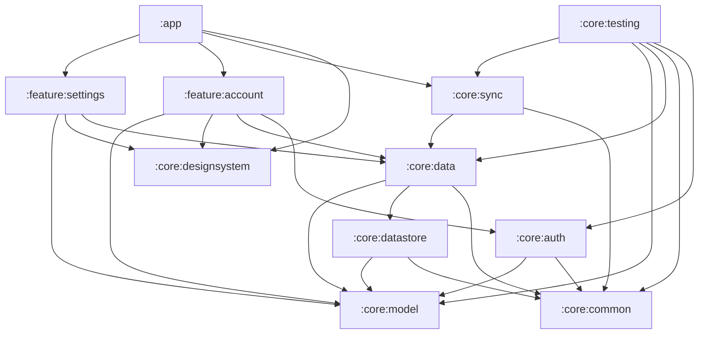

# rolabox

[](https://github.com/toomanyeduardos/rolabox/actions/workflows/ci.yml)

Yet another offline music player.

## Decisions

The reasoning behind the architecture is recorded as [Architecture Decision Records](docs/adr/README.md):

- [ADR-000](docs/adr/000-record-architecture-decisions.md): Record architecture decisions
- [ADR-001](docs/adr/001-layered-architecture.md): Layered architecture with a domain layer that owns the repository interfaces
- [ADR-002](docs/adr/002-offline-first-data-flow.md): Offline-first data flow with the local database as the single source of truth
- [ADR-003](docs/adr/003-module-boundaries.md): Module boundaries and dependency rules
- [ADR-004](docs/adr/004-convention-plugins.md): Share build configuration through convention plugins
- [ADR-005](docs/adr/005-hilt-dependency-injection.md): Use Hilt for dependency injection
- [ADR-006](docs/adr/006-async-api-shape.md): Async API shape: `Flow` for observed state, `suspend` for single operations
- [ADR-007](docs/adr/007-error-handling.md): Typed errors with Arrow `Either` for every fallible operation

## CI

[GitHub Actions](.github/workflows/ci.yml) runs on every pull request and every push to `main`: ktlint, detekt, `assembleDebug`, unit tests and Android Lint. Test and lint reports are uploaded as a `reports` artifact on each run.

## Static analysis

Every module gets [ktlint](https://pinterest.github.io/ktlint/) (with the [Compose rules](https://mrmans0n.github.io/compose-rules/)) and [detekt](https://detekt.dev/) through the convention plugins in `build-logic`. There is no baseline: the codebase is expected to pass cleanly.

- Style settings: [`.editorconfig`](.editorconfig) (read by ktlint and the IDE)
- detekt overrides: [`config/detekt/detekt.yml`](config/detekt/detekt.yml) (on top of detekt's defaults)

| Command | What it does |
| --- | --- |
| `./gradlew check` | Everything: ktlint, detekt (including type-resolved rules), Android Lint and unit tests |
| `./gradlew ktlintCheck detekt` | Static analysis only (fast) |
| `./gradlew ktlintFormat` | Auto-fix ktlint violations |

### Pre-commit hook

A hook in [`.githooks/pre-commit`](.githooks/pre-commit) runs `ktlintCheck` and `detekt` before each commit. Enable it once per clone:

```bash
git config core.hooksPath .githooks
```

Bypass it for a single commit with `git commit --no-verify`.

## Modules

| Module | Purpose |
| --- | --- |
| `:app` | Application shell: entry point, app identity, wires features together |
| `:core:model` | Pure Kotlin domain models (no Android dependencies) |
| `:core:common` | Shared utilities: coroutine dispatchers, result types |
| `:core:designsystem` | Theme and shared composables |
| `:core:data` | Repositories |
| `:core:datastore` | Local preferences |
| `:core:auth` | Authentication abstraction; the Firebase implementation lives behind an interface |
| `:core:sync` | Sync abstraction |
| `:core:testing` | Test-only: Hilt test runner, fakes, and `@TestInstallIn` modules that swap production bindings |
| `:feature:account` | Sign-in and account UI |
| `:feature:settings` | Settings UI |

### Dependency rules

The full set of rules, and the reasoning behind them, is in [ADR-003](docs/adr/003-module-boundaries.md). These are enforced by the build (see `build-logic/.../ModuleRules.kt`); breaking one fails configuration.

- Feature modules never depend on other feature modules.
- `:core:model` depends on no other module.

### Module graph

Generated from the build. After changing module dependencies, regenerate with `./gradlew moduleGraph`.

<!-- module-graph:start -->

<!-- module-graph:end -->
