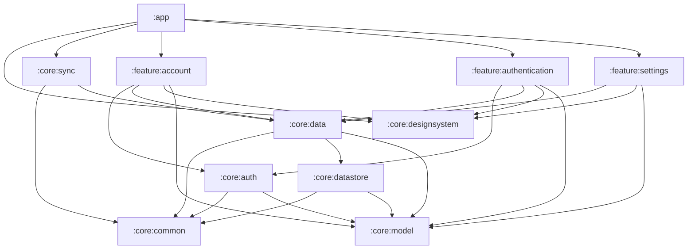

# rolabox
Offline music player

## Modules

| Module | Purpose |
| --- | --- |
| `:app` | Application shell: entry point, app identity, wires features together |
| `:core:model` | Pure Kotlin domain models (no Android dependencies) |
| `:core:common` | Shared utilities: coroutine dispatchers, result types |
| `:core:designsystem` | Theme and shared composables |
| `:core:data` | Repositories |
| `:core:datastore` | Local preferences |
| `:core:auth` | Authentication abstraction; the Firebase implementation lives behind an interface |
| `:core:sync` | Sync abstraction |
| `:feature:authentication` | Sign-in UI |
| `:feature:account` | Account UI |
| `:feature:settings` | Settings UI |

### Dependency rules

These are enforced by the build (see `build-logic/.../ModuleRules.kt`); breaking one fails configuration.

- Feature modules never depend on other feature modules.
- `:core:model` depends on no other module.

### Module graph

Generated from the build. After changing module dependencies, regenerate with `./gradlew moduleGraph`.

<!-- module-graph:start -->

<!-- module-graph:end -->
