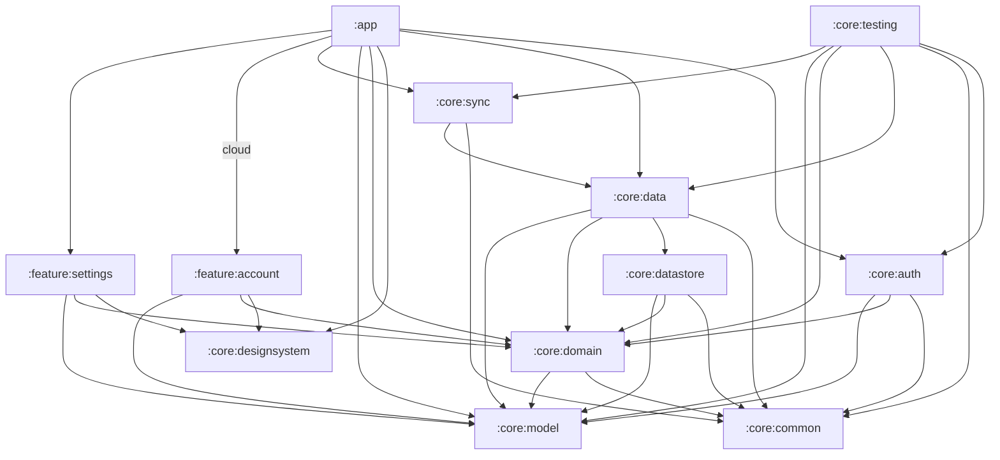

# rolabox

[](https://github.com/toomanyeduardos/rolabox/actions/workflows/ci.yml)

Yet another offline music player.

## Building

The app has two flavors ([ADR-008](docs/adr/008-offline-and-cloud-flavors.md)):

| Flavor | What it is | Firebase config needed |
| --- | --- | --- |
| `offline` (default) | The full player with no backend: no Firebase, no Play services, and no account features | No |
| `cloud` | Adds Firebase: sign-in and account features, and later sync | Yes, your own `google-services.json` |

A fresh clone builds the offline flavor with no setup:

```bash
./gradlew assembleOfflineDebug
```

Install it on a connected device or emulator with `./gradlew installOfflineDebug`, or pick the
`offlineDebug` build variant in Android Studio (it's selected by default).

### Building the cloud flavor

`google-services.json` identifies a Firebase project, so it isn't checked in. To build `cloud`,
use your own Firebase project:

1. In the [Firebase console](https://console.firebase.google.com/), create a project (or open an
   existing one) and add an Android app with the package name `com.eduardoflores.rolabox`.
2. Enable the sign-in providers you want under **Authentication**.
3. Download `google-services.json` and save it as `app/google-services.json`. It's already
   git-ignored, so don't commit it.
4. Build it:

   ```bash
   ./gradlew assembleCloudDebug
   ```

Without the file, `:app` has no cloud variants, so `./gradlew check` and the offline build still
work. Asking for a cloud app task (such as `assembleCloudDebug`) fails with a message pointing
here.

## Decisions

The reasoning behind the architecture is recorded as [Architecture Decision Records](docs/adr/README.md):

- [ADR-000](docs/adr/000-record-architecture-decisions.md): Record architecture decisions
- [ADR-001](docs/adr/001-layered-architecture.md): Layered architecture with a domain layer that owns the repository interfaces
- [ADR-002](docs/adr/002-offline-first-data-flow.md): Offline-first data flow with the local database as the single source of truth
- [ADR-003](docs/adr/003-module-boundaries.md): Module boundaries and dependency rules
- [ADR-004](docs/adr/004-convention-plugins.md): Share build configuration through convention plugins
- [ADR-005](docs/adr/005-hilt-dependency-injection.md): Use Hilt for dependency injection
- [ADR-006](docs/adr/006-async-api-shape.md): Async API shape: `Flow` for observed state, `suspend` for single operations
- [ADR-007](docs/adr/007-error-handling.md): Typed errors with Arrow `Either` for every fallible operation
- [ADR-008](docs/adr/008-offline-and-cloud-flavors.md): Offline and cloud build flavors, with Firebase only in cloud

## CI

[GitHub Actions](.github/workflows/ci.yml) runs two jobs in parallel on every pull request and every push to `main`:

- **`build`** (the `offline` flavor, built the way a fresh clone is): ktlint, detekt, `assembleOfflineDebug`, a check that no Firebase or Play services code reaches the offline app, unit tests and Android Lint.
- **`cloud`**: writes a placeholder `google-services.json`, then runs detekt on `:app`, `assembleCloudDebug`, unit tests and Android Lint. This catches cloud-only breakage, such as a missing Hilt binding. It needs no secrets, because nothing talks to Firebase.

Test and lint reports are uploaded as `reports` and `reports-cloud` artifacts on each run.

## Static analysis

Every module gets [ktlint](https://pinterest.github.io/ktlint/) (with the [Compose rules](https://mrmans0n.github.io/compose-rules/)) and [detekt](https://detekt.dev/) through the convention plugins in `build-logic`. There is no baseline: the codebase is expected to pass cleanly.

- Style settings: [`.editorconfig`](.editorconfig) (read by ktlint and the IDE)
- detekt overrides: [`config/detekt/detekt.yml`](config/detekt/detekt.yml) (on top of detekt's defaults)

| Command | What it does |
| --- | --- |
| `./gradlew check` | Everything: ktlint, detekt (including type-resolved rules), Android Lint and unit tests, for both flavors (`:app`'s cloud variants only when `google-services.json` is present) |
| `./gradlew ktlintCheck detekt` | Static analysis only (fast) |
| `./gradlew ktlintFormat` | Auto-fix ktlint violations |

### Pre-commit hook

A hook in [`.githooks/pre-commit`](.githooks/pre-commit) runs `ktlintCheck` and `detekt` before each commit. Enable it once per clone:

```bash
git config core.hooksPath .githooks
```

Bypass it for a single commit with `git commit --no-verify`.

## Modules

| Module | Purpose |
| --- | --- |
| `:app` | Application shell: entry point, app identity, wires features together |
| `:core:model` | Pure Kotlin domain models (no Android dependencies) |
| `:core:common` | Shared utilities: coroutine dispatchers, result types |
| `:core:domain` | Pure Kotlin repository interfaces, use cases and domain error types |
| `:core:designsystem` | Theme and shared composables |
| `:core:data` | Repository implementations, and helpers that turn exceptions into typed errors |
| `:core:datastore` | Local preferences |
| `:core:auth` | Authentication: Firebase in `cloud`, always signed out in `offline` |
| `:core:sync` | Sync abstraction (no-op in both flavors until there is data to sync) |
| `:core:testing` | Test-only: Hilt test runner, fakes, and `@TestInstallIn` modules that swap production bindings |
| `:feature:account` | Sign-in and account UI |
| `:feature:settings` | Settings UI |

### Dependency rules

The full set of rules, and the reasoning behind them, is in [ADR-003](docs/adr/003-module-boundaries.md). These are enforced by the build (see `build-logic/.../ModuleRules.kt`); breaking one fails configuration with an error naming the rule.

- Feature modules never depend on other feature modules.
- `:core:model` depends on no other module.
- `:core` modules never depend on feature modules, and only `:app` does.
- Feature modules depend on `:core:domain`, never on data-layer modules (`:core:data`, `:core:datastore`, `:core:auth`, `:core:sync`).
- `:core:domain`, `:core:model` and `:core:common` are JVM modules. `:core:domain` depends only on `:core:model` and `:core:common`, with no Hilt.
- `:core:designsystem` never depends on `:core:domain` or data-layer modules.
- `:core:testing` is only used from test configurations.

### Module graph

Generated from the build. After changing module dependencies, regenerate with `./gradlew moduleGraph`. Edges labelled with a flavor exist only in that flavor.

<!-- module-graph:start -->

<!-- module-graph:end -->
