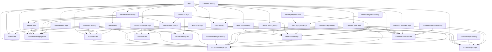

<div align="center">

# rlabox

**A music player for the music you actually own.**

Offline first, account optional, and dressed like the hi-fi you wanted in the early 2000s.

[](https://github.com/toomanyeduardos/rolabox/actions/workflows/ci.yml)
[](LICENSE)


&nbsp;

&nbsp;


*These are the real screenshot-test goldens, checked by Paparazzi on every CI run.*

*Work in progress: new screens are landing every few days, so this set will grow (and change) soon.*

</div>

---

## What is Rolabox?

Rolabox is an Android music player for your own audio files. No catalog, no subscription, no
algorithm. It works fully offline, and an account is something you can add, not something you
need.

It also has a look: brushed aluminum, a backlit LCD status bar, and a spinning record in the
wordmark. Think of a hardware player, not a streaming app.

> [!NOTE]
> **Rolabox is early and under very active development.** The foundations are in place (accounts,
> offline mode, preference sync, the design system, and the architecture and tooling around them),
> and new UI is landing every few days. The library and playback screens come next, so Home is
> still empty, and the screens and screenshots here will change often.

## How it behaves

- **You choose online or offline on first launch.** The app opens on *Sign in*, where you can sign
  in with email and password, continue with Google, create an account, or tap **Use offline
  without an account**. Rolabox remembers the choice, and opens straight on Home from then on
  ([ADR-008](docs/adr/008-one-app-with-offline-mode.md)).
- **Offline means offline.** In offline mode the app makes no Firebase requests at all. It's a
  choice that belongs to the device, not a separate build, and it never syncs anywhere.
- **Your data lives on your phone first.** The local database is the single source of truth. The
  UI reads local data, and sync happens in the background when you're signed in
  ([ADR-002](docs/adr/002-offline-first-data-flow.md)).
- **Signed in, your preferences follow you.** Preferences such as the theme (light, dark or
  system) and the accent color (blue, green, purple or pink) sync across devices through
  Firestore, field by field, with the latest change winning
  ([ADR-011](docs/adr/011-preferences-sync.md)).
- **One account per email.** Signing in with Google and with a password for the same email lands in
  the same account, linked automatically ([ADR-013](docs/adr/013-account-linking.md)).
- **Forgot your password?** Reset it by email, with a resend cooldown so nobody gets spammed.
- **Only you can read your data.** Firestore security rules limit each user to their own document,
  and they're tested against the emulator on every CI run
  ([ADR-010](docs/adr/010-firestore-security-rules.md)).

## Tech stack

| | |
| --- | --- |
| **Language** | Kotlin 2.4, coroutines and `Flow` |
| **UI** | Jetpack Compose, Material 3, a custom design system ([ADR-015](docs/adr/015-design-system-owns-visual-language.md)) |
| **Navigation** | Jetpack Navigation 3 ([ADR-012](docs/adr/012-navigation.md)) |
| **Dependency injection** | Hilt ([ADR-005](docs/adr/005-hilt-dependency-injection.md)) |
| **Errors** | Arrow `Either` with typed errors ([ADR-007](docs/adr/007-error-handling.md)) |
| **Storage** | DataStore |
| **Accounts and sync** | Firebase Auth, Cloud Firestore, Credential Manager, WorkManager |
| **Build** | Gradle with convention plugins in `build-logic` ([ADR-004](docs/adr/004-convention-plugins.md)) |
| **Quality** | ktlint (with Compose rules), detekt, Android Lint, Paparazzi screenshot tests |
| **Targets** | minSdk 29, targetSdk 37 |

## Getting started

There is one app ([ADR-008](docs/adr/008-one-app-with-offline-mode.md)). It always includes Firebase
and the account features, and "offline" is a choice the user makes in the app, not a build variant.
A fresh clone builds and runs with no setup:

```bash
./gradlew assembleDebug
```

Install it on a connected device or emulator with `./gradlew installDebug`, or run the `app`
configuration in Android Studio.

> [!TIP]
> Install [Git LFS](https://git-lfs.com/) before you clone (`brew install git-lfs && git lfs install`).
> The screenshot goldens live there, and without it you get text pointer files instead of images.

With no setup, the build uses the committed placeholder Firebase config,
[`app/google-services.placeholder.json`](app/google-services.placeholder.json). It points at
`demo-rolabox`, which isn't a real Firebase project, so the app works in offline mode, but sign-in and
sync fail. The build says so when it uses the placeholder.

### Building with Firebase

`google-services.json` isn't checked in, but not because it's secret. It ships inside every APK, so
anyone can read the project ID and API key, and the repo assumes they have. It's left out so that
clones and forks don't build against the maintainer's Firebase project and quota without noticing.
What actually protects the data is the [Firestore security rules](#firestore-security-rules). To use
sign-in and sync, use your own Firebase project:

1. In the [Firebase console](https://console.firebase.google.com/), create a project (or open an
   existing one) and add an Android app with the package name `com.eduardoflores.rolabox`.
2. Enable the sign-in providers you want under **Authentication**.
3. Download `google-services.json` and save it as `app/google-services.json`. It's git-ignored, and
   CI fails if it's ever committed. That's the only place it's read from: the build fails if it
   finds one under `app/src/`.
4. Build as usual. When `app/google-services.json` exists, the build uses it instead of the
   placeholder.

When you create the Firestore database in your project, start it in **production mode** (deny
all), not test mode, then deploy the rules below.

### Firestore security rules

The Firebase config is public, so the rules in
[`firebase/firestore.rules`](firebase/firestore.rules) are the real protection
([ADR-010](docs/adr/010-firestore-security-rules.md)): a signed-in user can only read and write
`users/{their uid}`, writes are checked against a field allowlist with type and size limits, and
everything else is denied.

The rules are tested against the Firestore emulator, using a `demo-rolabox` project that needs no
Firebase project or credentials. You need Node 22+ and a JDK 21+ (for the emulator):

```bash
cd firebase && npm ci && npm test
```

To deploy them to your own project (never edit rules in the console):

```bash
cd firebase && npx firebase deploy --only firestore:rules --project <your-project-id>
```

## Architecture

Rolabox is a layered, offline-first, multi-module app: UI → domain → data, with the domain layer
owning the repository interfaces ([ADR-001](docs/adr/001-layered-architecture.md)), `Flow` for
observed state and `suspend` for one-off operations
([ADR-006](docs/adr/006-async-api-shape.md)), and module boundaries that the build itself enforces.

### Decisions

Every architectural choice is written down as an
[Architecture Decision Record](docs/adr/README.md): the context, the alternatives, the trade-offs,
and the rules that follow. Most rules are enforced by the build or by tests, not just by review.

| ADR | Decision |
| --- | --- |
| [000](docs/adr/000-record-architecture-decisions.md) | Record architecture decisions |
| [001](docs/adr/001-layered-architecture.md) | Layered architecture with a domain layer that owns the repository interfaces |
| [002](docs/adr/002-offline-first-data-flow.md) | Offline-first data flow with the local database as the single source of truth |
| [003](docs/adr/003-module-boundaries.md) | Module boundaries and dependency rules |
| [004](docs/adr/004-convention-plugins.md) | Share build configuration through convention plugins |
| [005](docs/adr/005-hilt-dependency-injection.md) | Use Hilt for dependency injection |
| [006](docs/adr/006-async-api-shape.md) | Async API shape: `Flow` for observed state, `suspend` for single operations |
| [007](docs/adr/007-error-handling.md) | Typed errors with Arrow `Either` for every fallible operation |
| [008](docs/adr/008-one-app-with-offline-mode.md) | One app with Firebase built in, and offline mode as a user choice |
| [009](docs/adr/009-ui-bound-sdks.md) | SDK steps that need an Activity live in the UI, and only their results cross the `:api` |
| [010](docs/adr/010-firestore-security-rules.md) | Firestore for synced data, with per-user security rules tested against the emulator |
| [011](docs/adr/011-preferences-sync.md) | Sync preferences through Firestore, field by field, with last-write-wins |
| [012](docs/adr/012-navigation.md) | Navigation with Jetpack Navigation 3, with the back stacks owned by `:app` |
| [013](docs/adr/013-account-linking.md) | One account per email, with Google and password sign-in linked automatically |
| [014](docs/adr/014-area-ui-modules.md) | Area UI modules for SDK steps and shared UI, `:core:<area>:ui` |
| [015](docs/adr/015-design-system-owns-visual-language.md) | The design system is the only home of Rolabox's visual language |
| [016](docs/adr/016-screenshot-testing.md) | Screenshot tests with Paparazzi, run on the JVM with goldens in Git LFS |
| [017](docs/adr/017-accessibility.md) | Accessibility is an architectural rule, starting with large text |
| [018](docs/adr/018-device-navigation.md) | Device navigation: a linear screen stack driven by the wheel |
| [019](docs/adr/019-device-host-module.md) | The device is a host module, `:core:device`, that receives its screens from `:app` |
| [020](docs/adr/020-modules-by-product-area.md) | Modules grouped by product area, with the device assembling its own screens |
| [021](docs/adr/021-data-flow-through-layers.md) | Every layer is reached through an abstraction, from the screen to the data source |

### Modules

Modules are grouped by product area ([ADR-020](docs/adr/020-modules-by-product-area.md)): `:auth`
decides whether the user may reach the device, `:device` is the music player, and `:common` is what
both share. An area is made of parts, and a part is split into an `:api` module (a JVM module with
interfaces, models and error types, or the keys and entry contract of its screens), an `:impl`
module (the implementation and its Hilt bindings, or the screens and their ViewModels) and, when
there is something to fake, a `:testing` module.

| Module | Purpose |
| --- | --- |
| `:app` | Application shell and composition root: entry point, app identity, the app stack, and the place where the two areas meet |
| `:auth:data:api` | Authentication API: `AuthRepository`, `AuthUser`, `AuthError`, and the sign-in, sign-up and start-destination use cases |
| `:auth:data:impl` | Authentication with Firebase, the use cases' implementations, and who sync runs for |
| `:auth:data:testing` | `FakeAuthRepository` and the fake use cases |
| `:auth:ui:api` | The keys and entry contract of the auth screens, and `SignInConfig` |
| `:auth:ui:impl` | Sign in, Create account and Reset password, and the sign-in provider steps (Google) |
| `:auth:settings:impl` | The account section of the device's settings |
| `:device:host` | The device's mechanism: the screen stack inside the display, wheel event routing, and the contract device screens use |
| `:device:ui:api` | The device's keys and entry contract |
| `:device:ui:impl` | The device's assembly: its entries, the main menu, what each exit opens, the playback handlers |
| `:device:library:api` | The music library's API: `LibraryRepository`, `Artist`, `Album`, `Song`, `LibraryError` |
| `:device:library:impl` | The library, hard-coded and in memory for now (no database yet, ADR-002) |
| `:device:library:testing` | `FakeLibraryRepository` |
| `:device:music:ui:api` | The keys and entry contract of the music screens: Music, Artists, an artist's albums, songs |
| `:device:music:ui:impl` | The music screens and their ViewModels, on the library's data |
| `:device:settings:api` | The settings key, the slots of the settings list, and the contract of a contributed section |
| `:device:settings:impl` | The settings list |
| `:common:util` | Coroutine dispatchers and scopes, helpers that turn exceptions into typed errors |
| `:common:designsystem` | The visual language: theme, shared composables, the device's parts |
| `:common:testing` | Test-only: Hilt test runner, `MainDispatcherRule` |
| `:common:storage:api` | Local storage API: `PreferencesStore` (key-value settings), `StorageError` |
| `:common:storage:impl` | `PreferencesStore` backed by DataStore |
| `:common:storage:testing` | `FakePreferencesStore` |
| `:common:sync:api` | Sync API: `SyncRepository`, `SyncUserProvider`, `SyncedValue`, `LastWriteWins` |
| `:common:sync:impl` | Sync: preferences through Firestore and WorkManager, never in offline mode |
| `:common:sync:testing` | `FakeSyncRepository`, `FakeSyncUserProvider` |
| `:common:userdata:api` | User preferences API: `UserDataRepository`, `UserData`, `SyncedPreferencesRepository` |
| `:common:userdata:impl` | User preferences, stored through `PreferencesStore` |
| `:common:userdata:testing` | `FakeUserDataRepository` |

### Dependency rules

The full set of rules, and the reasoning behind them, is in [ADR-020](docs/adr/020-modules-by-product-area.md). These are enforced by the build (see `build-logic/.../ModuleRules.kt`); breaking one fails configuration with an error naming the rule.

- `:common:*` modules depend only on `:common:*` modules.
- No `:device` module depends on an `:auth` module.
- The only `:auth` module that depends on a `:device` module is `:auth:settings:impl`, and it depends only on `:device:settings:api`.
- Only `:app` depends on `:impl` modules.
- An `:impl` depends only on `:api` modules, `:common:util` and `:common:designsystem`, and a `:device` `:impl` also on `:device:host`.
- An `:api` is a JVM module with no Android dependencies and no Hilt, and depends only on other `:api` modules and `:common:util`.
- Testing modules (`:common:testing` and every `:testing`) are only used from test configurations.
- `:device:host` depends only on `:common:designsystem` and `:common:util`, and only `:device` `:impl` modules depend on it.

Every step from a screen to a data source depends on an abstraction ([ADR-021](docs/adr/021-data-flow-through-layers.md)), and detekt checks two parts of that: an `:api` module declares no class whose name ends in `UseCase` or `Repository`, since those are interfaces there, and no composable function takes or creates a `…ViewModelImpl`.

There is no shared model module: each type lives in the `:api` of the part that owns it.

### Module graph

Generated from the build. After changing module dependencies, regenerate with `./gradlew moduleGraph`.

<details>
<summary>Show the module graph</summary>

<!-- module-graph:start -->

```mermaid
graph TD
    app[":app"]
    auth_data_api[":auth:data:api"]
    auth_data_impl[":auth:data:impl"]
    auth_data_testing[":auth:data:testing"]
    auth_settings_impl[":auth:settings:impl"]
    auth_ui_api[":auth:ui:api"]
    auth_ui_impl[":auth:ui:impl"]
    common_designsystem[":common:designsystem"]
    common_storage_api[":common:storage:api"]
    common_storage_impl[":common:storage:impl"]
    common_storage_testing[":common:storage:testing"]
    common_sync_api[":common:sync:api"]
    common_sync_impl[":common:sync:impl"]
    common_sync_testing[":common:sync:testing"]
    common_testing[":common:testing"]
    common_userdata_api[":common:userdata:api"]
    common_userdata_impl[":common:userdata:impl"]
    common_userdata_testing[":common:userdata:testing"]
    common_util[":common:util"]
    device_host[":device:host"]
    device_library_api[":device:library:api"]
    device_library_impl[":device:library:impl"]
    device_library_testing[":device:library:testing"]
    device_music_ui_api[":device:music:ui:api"]
    device_music_ui_impl[":device:music:ui:impl"]
    device_playback_api[":device:playback:api"]
    device_playback_impl[":device:playback:impl"]
    device_playback_testing[":device:playback:testing"]
    device_settings_api[":device:settings:api"]
    device_settings_impl[":device:settings:impl"]
    device_ui_api[":device:ui:api"]
    device_ui_impl[":device:ui:impl"]
    app --> auth_data_api
    app --> auth_data_impl
    app --> auth_settings_impl
    app --> auth_ui_api
    app --> auth_ui_impl
    app --> common_designsystem
    app --> common_storage_api
    app --> common_storage_impl
    app --> common_sync_api
    app --> common_sync_impl
    app --> common_userdata_api
    app --> common_userdata_impl
    app --> device_library_impl
    app --> device_music_ui_impl
    app --> device_playback_impl
    app --> device_settings_impl
    app --> device_ui_api
    app --> device_ui_impl
    auth_data_api --> common_storage_api
    auth_data_impl --> auth_data_api
    auth_data_impl --> common_storage_api
    auth_data_impl --> common_sync_api
    auth_data_impl --> common_userdata_api
    auth_data_impl --> common_util
    auth_data_testing --> auth_data_api
    auth_data_testing --> common_storage_api
    auth_settings_impl --> auth_data_api
    auth_settings_impl --> auth_ui_api
    auth_settings_impl --> common_designsystem
    auth_settings_impl --> device_settings_api
    auth_ui_impl --> auth_data_api
    auth_ui_impl --> auth_ui_api
    auth_ui_impl --> common_designsystem
    auth_ui_impl --> common_storage_api
    auth_ui_impl --> common_userdata_api
    common_storage_impl --> common_storage_api
    common_storage_impl --> common_util
    common_storage_testing --> common_storage_api
    common_sync_impl --> common_storage_api
    common_sync_impl --> common_sync_api
    common_sync_impl --> common_userdata_api
    common_sync_impl --> common_util
    common_sync_testing --> common_sync_api
    common_userdata_api --> common_storage_api
    common_userdata_api --> common_sync_api
    common_userdata_impl --> common_storage_api
    common_userdata_impl --> common_sync_api
    common_userdata_impl --> common_userdata_api
    common_userdata_testing --> common_storage_api
    common_userdata_testing --> common_sync_api
    common_userdata_testing --> common_userdata_api
    device_host --> common_designsystem
    device_library_api --> common_storage_api
    device_library_impl --> device_library_api
    device_library_testing --> common_storage_api
    device_library_testing --> device_library_api
    device_music_ui_impl --> common_designsystem
    device_music_ui_impl --> device_host
    device_music_ui_impl --> device_library_api
    device_music_ui_impl --> device_music_ui_api
    device_playback_api --> device_library_api
    device_playback_impl --> device_library_api
    device_playback_impl --> device_playback_api
    device_playback_testing --> device_library_api
    device_playback_testing --> device_playback_api
    device_settings_impl --> common_designsystem
    device_settings_impl --> common_storage_api
    device_settings_impl --> common_userdata_api
    device_settings_impl --> device_settings_api
    device_ui_impl --> common_designsystem
    device_ui_impl --> device_host
    device_ui_impl --> device_music_ui_api
    device_ui_impl --> device_settings_api
    device_ui_impl --> device_ui_api
```
<!-- module-graph:end -->

</details>

## Quality

### Static analysis

Every module gets [ktlint](https://pinterest.github.io/ktlint/) (with the [Compose rules](https://mrmans0n.github.io/compose-rules/)) and [detekt](https://detekt.dev/) through the convention plugins in `build-logic`. There is no baseline: the codebase is expected to pass cleanly.

- Style settings: [`.editorconfig`](.editorconfig) (read by ktlint and the IDE)
- detekt overrides: [`config/detekt/detekt.yml`](config/detekt/detekt.yml) (on top of detekt's defaults)

| Command | What it does |
| --- | --- |
| `./gradlew check` | Everything: ktlint, detekt (including type-resolved rules), Android Lint and unit tests |
| `./gradlew unitTest` | Unit tests of every module (including screenshot tests): the debug variant of Android modules, and the pure Kotlin modules. Add `-Prolabox.skipScreenshotTests` to leave the screenshot tests out |
| `./gradlew test` | Unit tests of every variant of every module (debug and release) |
| `./gradlew ktlintCheck detekt` | Static analysis only (fast) |
| `./gradlew ktlintFormat` | Auto-fix ktlint violations |

#### Pre-commit hook

A hook in [`.githooks/pre-commit`](.githooks/pre-commit) runs `ktlintCheck` and `detekt` before each commit. Enable it once per clone:

```bash
git config core.hooksPath .githooks
```

Bypass it for a single commit with `git commit --no-verify`.

### Screenshot tests

UI is covered by screenshot tests made with [Paparazzi](https://github.com/cashapp/paparazzi) ([ADR-016](docs/adr/016-screenshot-testing.md)). They run on the JVM, with no emulator, as part of the module's unit tests. Every `@Preview` composable (including `@PreviewLightDark`) is rendered as a Pixel 6 in portrait, in light, in dark, and in light at 1.5x font scale, and compared with a golden image in the module's `src/test/snapshots/`.

| Command | What it does |
| --- | --- |
| `./gradlew verifyPaparazziDebug` | Compares every screenshot with its golden, and fails on a difference or a missing golden. Also runs in `./gradlew check` |
| `./gradlew recordPaparazziDebug` | Records the goldens again. Run it after a change that alters how UI looks, and review the images |
| `./gradlew cleanRecordPaparazziDebug` | Like `recordPaparazziDebug`, and also deletes the goldens of previews that no longer exist |

Prefix a task with a module path to run it for one module, for example `./gradlew :auth:ui:impl:verifyPaparazziDebug`. The aggregate `recordPaparazzi` and `verifyPaparazzi` tasks also exist, and cover every variant.

- **Goldens are in [Git LFS](https://git-lfs.com/).** Install it once per machine with `brew install git-lfs && git lfs install`, before cloning or committing goldens. Without it a clone has text pointer files instead of images.
- **A failing verify** writes the actual image and a `delta-` diff to `<module>/build/paparazzi/failures/`, and an HTML report to `<module>/build/reports/paparazzi/`. On CI they are the `screenshot-diffs` artifact.
- **A module with `@Preview` composables applies `rolabox.android.paparazzi`** and has a `PreviewSnapshotTest` (see [`auth/ui/impl`](auth/ui/impl/src/test/kotlin/com/eduardoflores/rolabox/auth/ui/impl/PreviewSnapshotTest.kt)). The build fails if it doesn't. The shared harness is in the design system's test fixtures.
- **Commit the goldens with the change** that caused them, in the same pull request. CI only verifies.

### CI

[GitHub Actions](.github/workflows/ci.yml) runs three jobs in parallel on every pull request and every push to `main`:

- **`build`** (built the way a fresh clone is, with the placeholder Firebase config): a check that no `google-services.json` is committed, ktlint, detekt, `assembleDebug`, unit tests (without the screenshot tests) and Android Lint. It needs no secrets, because nothing talks to Firebase.
- **`screenshots`**: verifies every screenshot golden (`verifyPaparazziDebug`). When it fails, the actual and diff images are uploaded as the `screenshot-diffs` artifact. It needs no secrets either.
- **`firestore-rules`**: runs the Firestore security rules tests against the emulator (`npm test` in `firebase/`). It also needs no secrets.

Test and lint reports are uploaded as the `reports` artifact on each run.

## License

Rolabox is licensed under the [Apache License 2.0](LICENSE).
