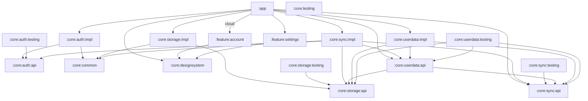

# rolabox

[](https://github.com/toomanyeduardos/rolabox/actions/workflows/ci.yml)

Yet another offline music player.

## Building

The app has two flavors ([ADR-008](docs/adr/008-offline-and-cloud-flavors.md)):

| Flavor | What it is | Firebase config needed |
| --- | --- | --- |
| `offline` (default) | The full player with no backend: no Firebase, no Play services, and no account features | No |
| `cloud` | Adds Firebase: sign-in, account features, and syncing preferences across devices | Yes, your own `google-services.json` |

A fresh clone builds the offline flavor with no setup:

```bash
./gradlew assembleOfflineDebug
```

Install it on a connected device or emulator with `./gradlew installOfflineDebug`, or pick the
`offlineDebug` build variant in Android Studio (it's selected by default).

### Building the cloud flavor

`google-services.json` isn't checked in, but not because it's secret. It ships inside every cloud
APK, so anyone can read the project ID and API key, and the repo assumes they have. It's left out
so that clones and forks don't build against the maintainer's Firebase project and quota without
noticing ([ADR-008](docs/adr/008-offline-and-cloud-flavors.md)). What actually protects the data is
the [Firestore security rules](#firestore-security-rules). To build `cloud`, use your own Firebase
project:

1. In the [Firebase console](https://console.firebase.google.com/), create a project (or open an
   existing one) and add an Android app with the package name `com.eduardoflores.rolabox`.
2. Enable the sign-in providers you want under **Authentication**.
3. Download `google-services.json` and save it as `app/google-services.json`. It's already
   git-ignored, so don't commit it.
4. Build it:

   ```bash
   ./gradlew assembleCloudDebug
   ```

Without the file, `:app` has no cloud variants, so `./gradlew check` and the offline build still
work. Asking for a cloud app task (such as `assembleCloudDebug`) fails with a message pointing
here.

When you create the Firestore database in your project, start it in **production mode** (deny
all), not test mode, then deploy the rules below.

## Firestore security rules

The Firebase config is public, so the rules in
[`firebase/firestore.rules`](firebase/firestore.rules) are the real protection
([ADR-010](docs/adr/010-firestore-security-rules.md)): a signed-in user can only read and write
`users/{their uid}`, writes are checked against a field allowlist with type and size limits, and
everything else is denied.

The rules are tested against the Firestore emulator, using a `demo-rolabox` project that needs no
Firebase project or credentials. You need Node 22+ and a JDK 21+ (for the emulator):

```bash
cd firebase && npm ci && npm test
```

To deploy them to your own project (never edit rules in the console):

```bash
cd firebase && npx firebase deploy --only firestore:rules --project <your-project-id>
```

## Decisions

The reasoning behind the architecture is recorded as [Architecture Decision Records](docs/adr/README.md):

- [ADR-000](docs/adr/000-record-architecture-decisions.md): Record architecture decisions
- [ADR-001](docs/adr/001-layered-architecture.md): Layered architecture with a domain layer that owns the repository interfaces
- [ADR-002](docs/adr/002-offline-first-data-flow.md): Offline-first data flow with the local database as the single source of truth
- [ADR-003](docs/adr/003-module-boundaries.md): Module boundaries and dependency rules
- [ADR-004](docs/adr/004-convention-plugins.md): Share build configuration through convention plugins
- [ADR-005](docs/adr/005-hilt-dependency-injection.md): Use Hilt for dependency injection
- [ADR-006](docs/adr/006-async-api-shape.md): Async API shape: `Flow` for observed state, `suspend` for single operations
- [ADR-007](docs/adr/007-error-handling.md): Typed errors with Arrow `Either` for every fallible operation
- [ADR-008](docs/adr/008-offline-and-cloud-flavors.md): Offline and cloud build flavors, with Firebase only in cloud
- [ADR-009](docs/adr/009-ui-bound-sdks.md): SDK steps that need an Activity live in the UI, and only their results cross the `:api`
- [ADR-010](docs/adr/010-firestore-security-rules.md): Firestore for synced data, with per-user security rules tested against the emulator
- [ADR-011](docs/adr/011-preferences-sync.md): Sync preferences through Firestore, field by field, with last-write-wins

## CI

[GitHub Actions](.github/workflows/ci.yml) runs three jobs in parallel on every pull request and every push to `main`:

- **`build`** (the `offline` flavor, built the way a fresh clone is): ktlint, detekt, `assembleOfflineDebug`, a check that no Firebase or Play services code reaches the offline app, unit tests and Android Lint.
- **`cloud`**: writes a placeholder `google-services.json`, then runs detekt on `:app`, `assembleCloudDebug`, unit tests and Android Lint. This catches cloud-only breakage, such as a missing Hilt binding. It needs no secrets, because nothing talks to Firebase.
- **`firestore-rules`**: runs the Firestore security rules tests against the emulator (`npm test` in `firebase/`). It also needs no secrets.

Test and lint reports are uploaded as `reports` and `reports-cloud` artifacts on each run.

## Static analysis

Every module gets [ktlint](https://pinterest.github.io/ktlint/) (with the [Compose rules](https://mrmans0n.github.io/compose-rules/)) and [detekt](https://detekt.dev/) through the convention plugins in `build-logic`. There is no baseline: the codebase is expected to pass cleanly.

- Style settings: [`.editorconfig`](.editorconfig) (read by ktlint and the IDE)
- detekt overrides: [`config/detekt/detekt.yml`](config/detekt/detekt.yml) (on top of detekt's defaults)

| Command | What it does |
| --- | --- |
| `./gradlew check` | Everything: ktlint, detekt (including type-resolved rules), Android Lint and unit tests, for both flavors (`:app`'s cloud variants only when `google-services.json` is present) |
| `./gradlew unitTest` | Unit tests of every module: the `offline` debug variant of Android modules, and the pure Kotlin modules |
| `./gradlew test` | Unit tests of every variant of every module (both flavors, debug and release) |
| `./gradlew ktlintCheck detekt` | Static analysis only (fast) |
| `./gradlew ktlintFormat` | Auto-fix ktlint violations |

### Pre-commit hook

A hook in [`.githooks/pre-commit`](.githooks/pre-commit) runs `ktlintCheck` and `detekt` before each commit. Enable it once per clone:

```bash
git config core.hooksPath .githooks
```

Bypass it for a single commit with `git commit --no-verify`.

## Modules

`:core` modules are organized by area ([ADR-003](docs/adr/003-module-boundaries.md)). Each area has
an `:api` module (pure Kotlin interfaces, models and error types), an `:impl` module (the Android
implementation and its Hilt bindings) and a `:testing` module (fakes).

| Module | Purpose |
| --- | --- |
| `:app` | Application shell: entry point, app identity, wires features and `:impl` modules together |
| `:core:auth:api` | Authentication API: `AuthRepository`, `AuthUser` |
| `:core:auth:impl` | Authentication: Firebase in `cloud`, always signed out in `offline` |
| `:core:auth:testing` | `FakeAuthRepository` |
| `:core:storage:api` | Local storage API: `PreferencesStore` (key-value settings), `StorageError` |
| `:core:storage:impl` | `PreferencesStore` backed by DataStore |
| `:core:storage:testing` | `FakePreferencesStore` |
| `:core:sync:api` | Sync API: `SyncRepository`, `SyncedValue`, `LastWriteWins` |
| `:core:sync:impl` | Sync: preferences through Firestore and WorkManager in `cloud`, no-op in `offline` |
| `:core:sync:testing` | `FakeSyncRepository` |
| `:core:userdata:api` | User preferences API: `UserDataRepository`, `UserData`, `SyncedPreferencesRepository` |
| `:core:userdata:impl` | User preferences, stored through `PreferencesStore` |
| `:core:userdata:testing` | `FakeUserDataRepository` |
| `:core:common` | Utility: coroutine dispatchers, helpers that turn exceptions into typed errors |
| `:core:designsystem` | Utility: theme and shared composables |
| `:core:testing` | Utility, test-only: Hilt test runner, `MainDispatcherRule` |
| `:feature:account` | Sign-in and account UI |
| `:feature:settings` | Settings UI |

### Dependency rules

The full set of rules, and the reasoning behind them, is in [ADR-003](docs/adr/003-module-boundaries.md). These are enforced by the build (see `build-logic/.../ModuleRules.kt`); breaking one fails configuration with an error naming the rule.

- Feature modules never depend on other feature modules, and only `:app` depends on feature modules.
- Only `:app` depends on `:impl` modules, and an `:impl` depends only on `:api` modules and `:core:common`.
- Feature modules depend only on `:api` modules, `:core:domain` (once it exists), `:core:common` and `:core:designsystem`.
- `:api` modules and `:core:common` are JVM modules. `:api` modules depend only on `:core:common` and other `:api` modules, with no Hilt.
- `:core:designsystem` depends only on `:core:common`.
- Testing modules (`:core:testing` and every `:core:<area>:testing`) are only used from test configurations.

`:api` modules hold only interfaces and models (plus pure-logic use cases), and there is no shared model module: each type lives in the `:api` of the area that owns it.

### Module graph

Generated from the build. After changing module dependencies, regenerate with `./gradlew moduleGraph`. Edges labelled with a flavor exist only in that flavor.

<!-- module-graph:start -->

```mermaid
graph TD
    app[":app"]
    core_auth_api[":core:auth:api"]
    core_auth_impl[":core:auth:impl"]
    core_auth_testing[":core:auth:testing"]
    core_common[":core:common"]
    core_designsystem[":core:designsystem"]
    core_storage_api[":core:storage:api"]
    core_storage_impl[":core:storage:impl"]
    core_storage_testing[":core:storage:testing"]
    core_sync_api[":core:sync:api"]
    core_sync_impl[":core:sync:impl"]
    core_sync_testing[":core:sync:testing"]
    core_testing[":core:testing"]
    core_userdata_api[":core:userdata:api"]
    core_userdata_impl[":core:userdata:impl"]
    core_userdata_testing[":core:userdata:testing"]
    feature_account[":feature:account"]
    feature_settings[":feature:settings"]
    app --> core_auth_impl
    app --> core_designsystem
    app --> core_storage_impl
    app --> core_sync_api
    app --> core_sync_impl
    app --> core_userdata_api
    app --> core_userdata_impl
    app -->|cloud| feature_account
    app --> feature_settings
    core_auth_impl --> core_auth_api
    core_auth_impl --> core_common
    core_auth_testing --> core_auth_api
    core_storage_impl --> core_common
    core_storage_impl --> core_storage_api
    core_storage_testing --> core_storage_api
    core_sync_impl --> core_auth_api
    core_sync_impl --> core_common
    core_sync_impl --> core_storage_api
    core_sync_impl --> core_sync_api
    core_sync_impl --> core_userdata_api
    core_sync_testing --> core_sync_api
    core_userdata_api --> core_storage_api
    core_userdata_api --> core_sync_api
    core_userdata_impl --> core_storage_api
    core_userdata_impl --> core_sync_api
    core_userdata_impl --> core_userdata_api
    core_userdata_testing --> core_storage_api
    core_userdata_testing --> core_sync_api
    core_userdata_testing --> core_userdata_api
    feature_account --> core_designsystem
    feature_settings --> core_designsystem
```
<!-- module-graph:end -->
