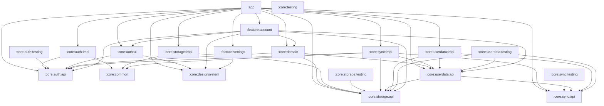

# rolabox

[](https://github.com/toomanyeduardos/rolabox/actions/workflows/ci.yml)

Yet another offline music player.

## Building

There is one app ([ADR-008](docs/adr/008-one-app-with-offline-mode.md)). It always includes Firebase
and the account features, and "offline" is a choice the user makes in the app, not a build variant.
A fresh clone builds and runs with no setup:

```bash
./gradlew assembleDebug
```

Install it on a connected device or emulator with `./gradlew installDebug`, or run the `app`
configuration in Android Studio.

With no setup, the build uses the committed placeholder Firebase config,
[`app/google-services.placeholder.json`](app/google-services.placeholder.json). It points at
`demo-rolabox`, which isn't a real Firebase project, so the app works in offline mode, but sign-in and
sync fail. The build says so when it uses the placeholder.

### Building with Firebase

`google-services.json` isn't checked in, but not because it's secret. It ships inside every APK, so
anyone can read the project ID and API key, and the repo assumes they have. It's left out so that
clones and forks don't build against the maintainer's Firebase project and quota without noticing.
What actually protects the data is the [Firestore security rules](#firestore-security-rules). To use
sign-in and sync, use your own Firebase project:

1. In the [Firebase console](https://console.firebase.google.com/), create a project (or open an
   existing one) and add an Android app with the package name `com.eduardoflores.rolabox`.
2. Enable the sign-in providers you want under **Authentication**.
3. Download `google-services.json` and save it as `app/google-services.json`. It's git-ignored, and
   CI fails if it's ever committed. That's the only place it's read from: the build fails if it
   finds one under `app/src/`.
4. Build as usual. When `app/google-services.json` exists, the build uses it instead of the
   placeholder.

When you create the Firestore database in your project, start it in **production mode** (deny
all), not test mode, then deploy the rules below.

## Firestore security rules

The Firebase config is public, so the rules in
[`firebase/firestore.rules`](firebase/firestore.rules) are the real protection
([ADR-010](docs/adr/010-firestore-security-rules.md)): a signed-in user can only read and write
`users/{their uid}`, writes are checked against a field allowlist with type and size limits, and
everything else is denied.

The rules are tested against the Firestore emulator, using a `demo-rolabox` project that needs no
Firebase project or credentials. You need Node 22+ and a JDK 21+ (for the emulator):

```bash
cd firebase && npm ci && npm test
```

To deploy them to your own project (never edit rules in the console):

```bash
cd firebase && npx firebase deploy --only firestore:rules --project <your-project-id>
```

## Decisions

The reasoning behind the architecture is recorded as [Architecture Decision Records](docs/adr/README.md):

- [ADR-000](docs/adr/000-record-architecture-decisions.md): Record architecture decisions
- [ADR-001](docs/adr/001-layered-architecture.md): Layered architecture with a domain layer that owns the repository interfaces
- [ADR-002](docs/adr/002-offline-first-data-flow.md): Offline-first data flow with the local database as the single source of truth
- [ADR-003](docs/adr/003-module-boundaries.md): Module boundaries and dependency rules
- [ADR-004](docs/adr/004-convention-plugins.md): Share build configuration through convention plugins
- [ADR-005](docs/adr/005-hilt-dependency-injection.md): Use Hilt for dependency injection
- [ADR-006](docs/adr/006-async-api-shape.md): Async API shape: `Flow` for observed state, `suspend` for single operations
- [ADR-007](docs/adr/007-error-handling.md): Typed errors with Arrow `Either` for every fallible operation
- [ADR-008](docs/adr/008-one-app-with-offline-mode.md): One app with Firebase built in, and offline mode as a user choice
- [ADR-009](docs/adr/009-ui-bound-sdks.md): SDK steps that need an Activity live in the UI, and only their results cross the `:api`
- [ADR-010](docs/adr/010-firestore-security-rules.md): Firestore for synced data, with per-user security rules tested against the emulator
- [ADR-011](docs/adr/011-preferences-sync.md): Sync preferences through Firestore, field by field, with last-write-wins
- [ADR-012](docs/adr/012-navigation.md): Navigation with Jetpack Navigation 3, with the back stacks owned by `:app`
- [ADR-013](docs/adr/013-account-linking.md): One account per email, with Google and password sign-in linked automatically
- [ADR-014](docs/adr/014-area-ui-modules.md): Area UI modules for SDK steps and shared UI, `:core:<area>:ui`
- [ADR-015](docs/adr/015-design-system-owns-visual-language.md): The design system is the only home of Rolabox's visual language
- [ADR-016](docs/adr/016-screenshot-testing.md): Screenshot tests with Paparazzi, run on the JVM with goldens in Git LFS

## CI

[GitHub Actions](.github/workflows/ci.yml) runs three jobs in parallel on every pull request and every push to `main`:

- **`build`** (built the way a fresh clone is, with the placeholder Firebase config): a check that no `google-services.json` is committed, ktlint, detekt, `assembleDebug`, unit tests (without the screenshot tests) and Android Lint. It needs no secrets, because nothing talks to Firebase.
- **`screenshots`**: verifies every screenshot golden (`verifyPaparazziDebug`). When it fails, the actual and diff images are uploaded as the `screenshot-diffs` artifact. It needs no secrets either.
- **`firestore-rules`**: runs the Firestore security rules tests against the emulator (`npm test` in `firebase/`). It also needs no secrets.

Test and lint reports are uploaded as the `reports` artifact on each run.

## Screenshot tests

UI is covered by screenshot tests made with [Paparazzi](https://github.com/cashapp/paparazzi) ([ADR-016](docs/adr/016-screenshot-testing.md)). They run on the JVM, with no emulator, as part of the module's unit tests. Every `@Preview` composable (including `@PreviewLightDark`) is rendered as a Pixel 6 in portrait, in light, in dark, and in light at 1.5x font scale, and compared with a golden image in the module's `src/test/snapshots/`.

| Command | What it does |
| --- | --- |
| `./gradlew verifyPaparazziDebug` | Compares every screenshot with its golden, and fails on a difference or a missing golden. Also runs in `./gradlew check` |
| `./gradlew recordPaparazziDebug` | Records the goldens again. Run it after a change that alters how UI looks, and review the images |
| `./gradlew cleanRecordPaparazziDebug` | Like `recordPaparazziDebug`, and also deletes the goldens of previews that no longer exist |

Prefix a task with a module path to run it for one module, for example `./gradlew :feature:account:verifyPaparazziDebug`. The aggregate `recordPaparazzi` and `verifyPaparazzi` tasks also exist, and cover every variant.

- **Goldens are in [Git LFS](https://git-lfs.com/).** Install it once per machine with `brew install git-lfs && git lfs install`, before cloning or committing goldens. Without it a clone has text pointer files instead of images.
- **A failing verify** writes the actual image and a `delta-` diff to `<module>/build/paparazzi/failures/`, and an HTML report to `<module>/build/reports/paparazzi/`. On CI they are the `screenshot-diffs` artifact.
- **A module with `@Preview` composables applies `rolabox.android.paparazzi`** and has a `PreviewSnapshotTest` (see [`feature/account`](feature/account/src/test/kotlin/com/eduardoflores/rolabox/feature/account/PreviewSnapshotTest.kt)). The build fails if it doesn't. The shared harness is in the design system's test fixtures.
- **Commit the goldens with the change** that caused them, in the same pull request. CI only verifies.

## Static analysis

Every module gets [ktlint](https://pinterest.github.io/ktlint/) (with the [Compose rules](https://mrmans0n.github.io/compose-rules/)) and [detekt](https://detekt.dev/) through the convention plugins in `build-logic`. There is no baseline: the codebase is expected to pass cleanly.

- Style settings: [`.editorconfig`](.editorconfig) (read by ktlint and the IDE)
- detekt overrides: [`config/detekt/detekt.yml`](config/detekt/detekt.yml) (on top of detekt's defaults)

| Command | What it does |
| --- | --- |
| `./gradlew check` | Everything: ktlint, detekt (including type-resolved rules), Android Lint and unit tests |
| `./gradlew unitTest` | Unit tests of every module (including screenshot tests): the debug variant of Android modules, and the pure Kotlin modules. Add `-Prolabox.skipScreenshotTests` to leave the screenshot tests out |
| `./gradlew test` | Unit tests of every variant of every module (debug and release) |
| `./gradlew ktlintCheck detekt` | Static analysis only (fast) |
| `./gradlew ktlintFormat` | Auto-fix ktlint violations |

### Pre-commit hook

A hook in [`.githooks/pre-commit`](.githooks/pre-commit) runs `ktlintCheck` and `detekt` before each commit. Enable it once per clone:

```bash
git config core.hooksPath .githooks
```

Bypass it for a single commit with `git commit --no-verify`.

## Modules

`:core` modules are organized by area ([ADR-003](docs/adr/003-module-boundaries.md)). Each area has
an `:api` module (pure Kotlin interfaces, models and error types), an `:impl` module (the Android
implementation and its Hilt bindings) and a `:testing` module (fakes). An area with UI-bound code,
such as an SDK step that shows system UI, also has a `:ui` module
([ADR-014](docs/adr/014-area-ui-modules.md)).

| Module | Purpose |
| --- | --- |
| `:app` | Application shell: entry point, app identity, wires features and `:impl` modules together |
| `:core:auth:api` | Authentication API: `AuthRepository`, `AuthUser` |
| `:core:auth:impl` | Authentication with Firebase |
| `:core:auth:testing` | `FakeAuthRepository` |
| `:core:auth:ui` | Sign-in UI shared by features: the provider steps (Google) and their buttons |
| `:core:storage:api` | Local storage API: `PreferencesStore` (key-value settings), `StorageError` |
| `:core:storage:impl` | `PreferencesStore` backed by DataStore |
| `:core:storage:testing` | `FakePreferencesStore` |
| `:core:sync:api` | Sync API: `SyncRepository`, `SyncedValue`, `LastWriteWins` |
| `:core:sync:impl` | Sync: preferences through Firestore and WorkManager, never in offline mode |
| `:core:sync:testing` | `FakeSyncRepository` |
| `:core:userdata:api` | User preferences API: `UserDataRepository`, `UserData`, `SyncedPreferencesRepository` |
| `:core:userdata:impl` | User preferences, stored through `PreferencesStore` |
| `:core:userdata:testing` | `FakeUserDataRepository` |
| `:core:domain` | Use cases that combine more than one area, such as `ResolveStartDestinationUseCase` (pure Kotlin) |
| `:core:common` | Utility: coroutine dispatchers, helpers that turn exceptions into typed errors |
| `:core:designsystem` | Utility: theme and shared composables |
| `:core:testing` | Utility, test-only: Hilt test runner, `MainDispatcherRule` |
| `:feature:account` | Sign-in and account UI |
| `:feature:settings` | Settings UI |

### Dependency rules

The full set of rules, and the reasoning behind them, is in [ADR-003](docs/adr/003-module-boundaries.md). These are enforced by the build (see `build-logic/.../ModuleRules.kt`); breaking one fails configuration with an error naming the rule.

- Feature modules never depend on other feature modules, and only `:app` depends on feature modules.
- Only `:app` depends on `:impl` modules, and an `:impl` depends only on `:api` modules and `:core:common`.
- Feature modules depend only on `:api` and `:ui` modules, `:core:domain`, `:core:common` and `:core:designsystem`.
- `:ui` modules depend only on `:api` modules, `:core:domain`, `:core:common` and `:core:designsystem`, and only features and `:app` depend on them. They have no ViewModels or navigation destinations.
- `:api` modules, `:core:common` and `:core:domain` are JVM modules. `:api` modules depend only on `:core:common` and other `:api` modules, with no Hilt. `:core:domain` depends only on `:api` modules and `:core:common`.
- `:core:designsystem` depends only on `:core:common`.
- Testing modules (`:core:testing` and every `:core:<area>:testing`) are only used from test configurations.

`:api` modules hold only interfaces and models (plus pure-logic use cases), and there is no shared model module: each type lives in the `:api` of the area that owns it.

### Module graph

Generated from the build. After changing module dependencies, regenerate with `./gradlew moduleGraph`.

<!-- module-graph:start -->

```mermaid
graph TD
    app[":app"]
    core_auth_api[":core:auth:api"]
    core_auth_impl[":core:auth:impl"]
    core_auth_testing[":core:auth:testing"]
    core_auth_ui[":core:auth:ui"]
    core_common[":core:common"]
    core_designsystem[":core:designsystem"]
    core_domain[":core:domain"]
    core_storage_api[":core:storage:api"]
    core_storage_impl[":core:storage:impl"]
    core_storage_testing[":core:storage:testing"]
    core_sync_api[":core:sync:api"]
    core_sync_impl[":core:sync:impl"]
    core_sync_testing[":core:sync:testing"]
    core_testing[":core:testing"]
    core_userdata_api[":core:userdata:api"]
    core_userdata_impl[":core:userdata:impl"]
    core_userdata_testing[":core:userdata:testing"]
    feature_account[":feature:account"]
    feature_settings[":feature:settings"]
    app --> core_auth_api
    app --> core_auth_impl
    app --> core_auth_ui
    app --> core_designsystem
    app --> core_domain
    app --> core_storage_api
    app --> core_storage_impl
    app --> core_sync_api
    app --> core_sync_impl
    app --> core_userdata_api
    app --> core_userdata_impl
    app --> feature_account
    app --> feature_settings
    core_auth_impl --> core_auth_api
    core_auth_impl --> core_common
    core_auth_testing --> core_auth_api
    core_auth_ui --> core_auth_api
    core_auth_ui --> core_designsystem
    core_domain --> core_auth_api
    core_domain --> core_storage_api
    core_domain --> core_userdata_api
    core_storage_impl --> core_common
    core_storage_impl --> core_storage_api
    core_storage_testing --> core_storage_api
    core_sync_impl --> core_auth_api
    core_sync_impl --> core_common
    core_sync_impl --> core_storage_api
    core_sync_impl --> core_sync_api
    core_sync_impl --> core_userdata_api
    core_sync_testing --> core_sync_api
    core_userdata_api --> core_storage_api
    core_userdata_api --> core_sync_api
    core_userdata_impl --> core_storage_api
    core_userdata_impl --> core_sync_api
    core_userdata_impl --> core_userdata_api
    core_userdata_testing --> core_storage_api
    core_userdata_testing --> core_sync_api
    core_userdata_testing --> core_userdata_api
    feature_account --> core_auth_api
    feature_account --> core_auth_ui
    feature_account --> core_designsystem
    feature_account --> core_domain
    feature_account --> core_storage_api
    feature_account --> core_userdata_api
    feature_settings --> core_designsystem
```
<!-- module-graph:end -->
